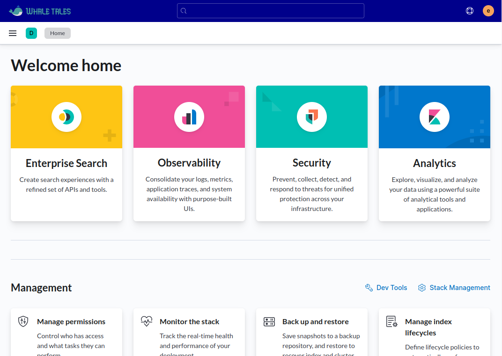

# Custom Kibana Logo

A Kibana plugin to customise the Kibana UI, including:
- Loader logo and text
- Login form
- Header logo
- Spaces selector logo
- Search bar text
- Dashboard colors
- Fonts and font sizes




## Known limitations

When Kibana first loads, it shows a Kibana loader for a few seconds. 
Since it is shown before any css is loaded, it is impossible to change that loader without modifying the source code of the plugin.

## Development

### Prerequisites

#### Node

Running Kibana in development mode requires having `node` installed.

The most convenient way is to install `nvm`, then once you checkout the kibana repository, run `nvm use` to know which version of node to use.

Install the right version by running:

```
nvm install VERSION
```

#### yarn

Install `yarn` by running: 

```
npm install --global yarn
```

### Environment setup

Checkout the appropriate version of kibana

```
git clone https://github.com/elastic/kibana.git
cd kibana
git checkout KIBANA_VERSION
```

Setup the kibana for local development

```
yarn kbn bootstrap 
```

Clone the plugin into the plugins directory.
You may also fork the project to customize it and check out your own version of the plugin.

```
cd plugins
git clone https://github.com/lizozom/custom-kibana-logo.git
```

Go back to the kibana folder and start Elasticsearch in dev mode

```
cd ..
yarn es snapshot
```

Start Kibana in dev mode (This might take a while the first time)

```
cd ..
yarn start --no-base-path
```

Kibana should start with the plugin on.
It will watch any changes in the plugin and rebuild it as needed.

### Changing Kibana fonts
If you decide to change the font of Kibana, make sure to customize the `Content Security Policy` with the base URL of font in `kibana.yml`

```
csp.style_src: ["FONT_BASE_URL"]
csp.font_src: ["FONT_BASE_URL"]
```

## Production

Navigate into the plugin directory (within the kibana repository) and build it:

```
cd plugins/custom-kibana-logo
yarn build
```

This builds the plugin into a `zip` file under the `build` folder.

Place the build file on a web hosting or copy it to the deployment where you intend to install it, then install the plugin by running:

```
bin/kibana-plugin install PATH_TO_ZIP
```

More documentation on how to install a plugin from a `zip` file can be found [here](https://www.elastic.co/guide/en/kibana/master/kibana-plugins.html).